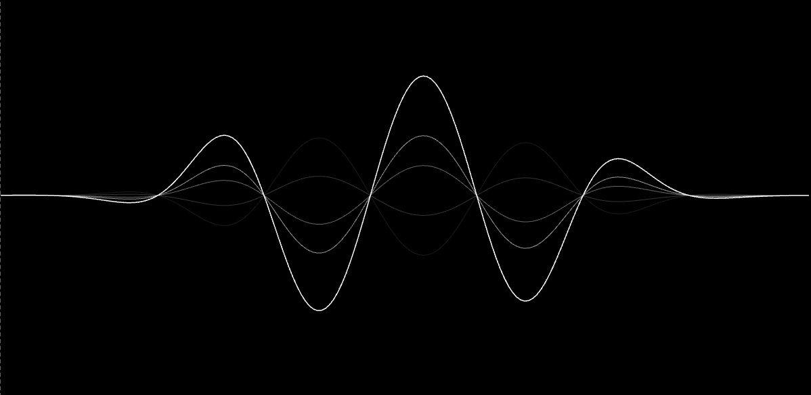

# 声音波纹



- 基于 [siriwave](https://github.com/kopiro/siriwave) 的声音波纹效果。
- 简化了声音录制部分。


## 使用

```html
<div id="bbwave"></div>
```

```js
import BBWave from 'bb-wave'

async function main() {
  const stream = await navigator.mediaDevices.getUserMedia({ audio: true });
  // 把数据流传给 BBWave
  const bbwave = new BBWave(document.getElementById('bbwave'));
  bbwave.start(stream);
}

main()

```

## 配置选项

暂无